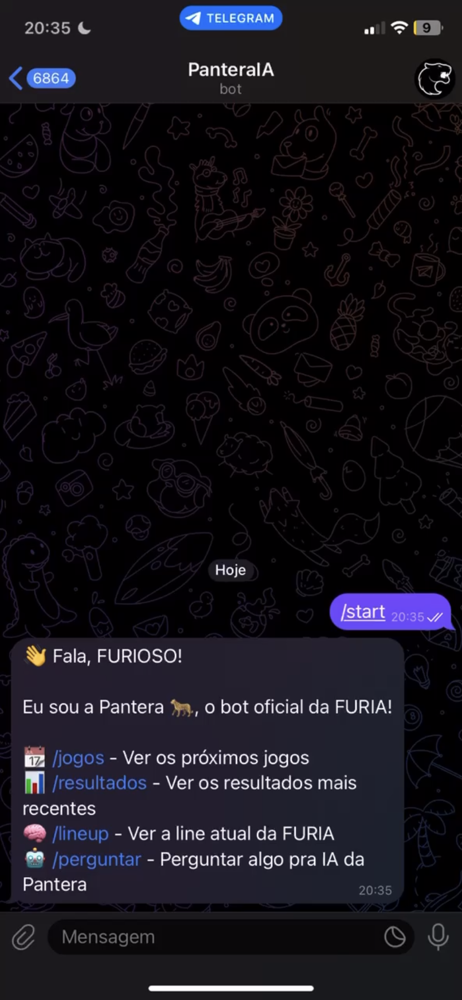
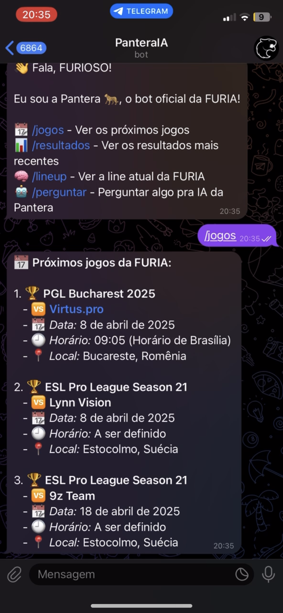
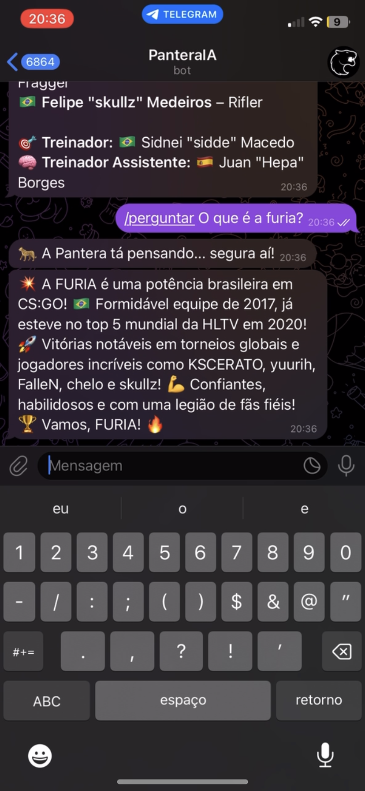
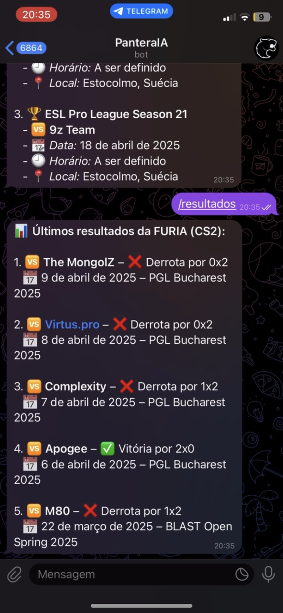
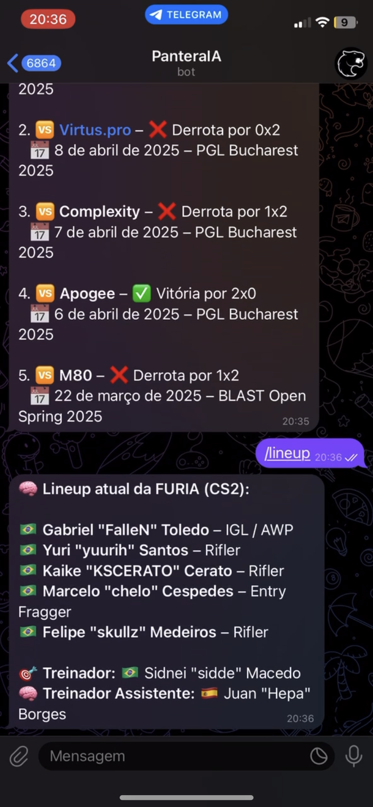

# 🐆 Pantera Bot – FURIA Fan Assistant (Telegram)

**Pantera Bot** é o chatbot oficial da mascote da FURIA Esports no Telegram!  
Com uma linguagem empolgada, respostas personalizadas e comandos úteis, o bot aproxima ainda mais os torcedores da FURIA do time de CS2.

> 💬 Acesse: [@PanteraFuriaBot](https://t.me/PanteraFuriaBot)

---

## 🎯 Objetivo

Criar um bot interativo, leve e divertido para o Telegram que represente a **Pantera**, mascote oficial da FURIA, com:
- Comandos rápidos e úteis para a torcida
- IA personalizada com contexto sobre a FURIA
- Estilo vibrante, provocador e torcedor

---

## 📸 Exemplos do Bot em ação

### Boas-vindas /start


### Comando /jogos


### Resposta da IA


### Comando /resultados


### Comando /lineup


### Bot no telegram


---

## 💡 Funcionalidades

- 👋 Mensagem de boas-vindas com instruções
- 📅 Exibição dos próximos jogos da FURIA
- 📊 Resultados mais recentes
- 🧠 Lineup atualizada com técnico e função
- 🤖 Perguntas livres com IA (com personalidade da Pantera!)

---

## 🧠 IA com personalidade

A IA responde como a **Pantera mascote da FURIA**:
- Empolgada, cheia de emoção e sempre defendendo o time
- Usa frases como: “**AQUI É FURIA, MEU PARCEIRO! 🔥**”
- Baseada no modelo **Mixtral 8x7B Instruct** via OpenRouter
- Utiliza RAG com contexto de lineup, resultados e histórico da FURIA

---

## 🔧 Comandos disponíveis

| Comando        | Descrição                                         |
|----------------|---------------------------------------------------|
| `/start`       | Mensagem inicial da Pantera                       |
| `/jogos`       | Exibe os próximos jogos da FURIA                  |
| `/resultados`  | Mostra os resultados mais recentes                |
| `/lineup`      | Mostra a lineup atual do time de CS2              |
| `/perguntar`   | Faz uma pergunta livre para a IA da Pantera       |

---

## ⚙️ Tecnologias Utilizadas

- **Python 3**
- **python-telegram-bot**
- **OpenRouter API** (com modelo Mixtral)
- **Railway** (deploy e variáveis de ambiente)

---

## 🚀 Como rodar localmente

```bash
git clone https://github.com/seu-usuario/pantera-bot.git
cd pantera-bot
```

Crie o arquivo `.env` com as chaves:

```env
TELEGRAM_BOT_TOKEN=seu_token_do_telegram
OPENROUTER_API_KEY=sua_api_key_openrouter
```

Instale as dependências:

```bash
pip install -r requirements.txt
```

Execute o bot:

```bash
python bot.py
```

---

## 💬 Exemplo de resposta da IA

> Quem é o melhor da FURIA?

🐆 “**KSCERATO tá jogando o fino do fino, bebê!**  
FalleN comanda tudo e o chelo chega rasgando!  
Se vier contra a FURIA, é bala na cara!  
AQUI É FURIA! 🔥🔥🔥”

---

## 📦 Futuras melhorias

- Comandos personalizados para estatísticas e jogadores
- Frases provocativas automáticas
- Integração com o FURIA Fan Hub
- Restrições de horário para IA e controle de tokens

---

## 👤 Desenvolvido por

**Filipe Marra**  
🐾 Desenvolvedor do [FURIA Fan Hub](https://github.com/filipemarraa/furia-fanhub)  
💻 GitHub: [@filipemarraa](https://github.com/filipemarraa)

---

> _"Quem vem contra a FURIA, volta pra casa chorando!"_ – Pantera 🐆
